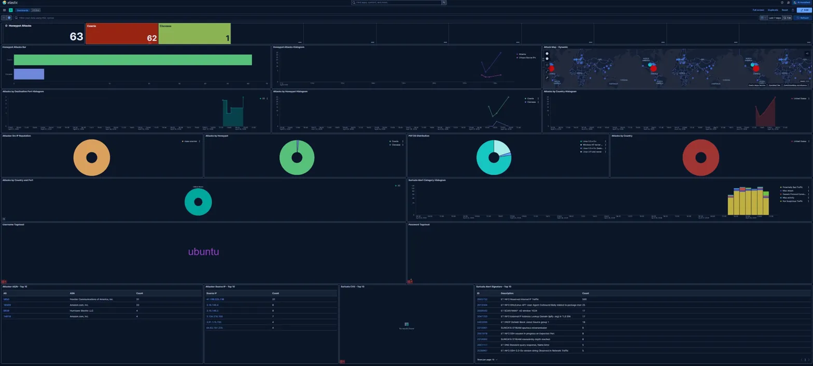

# 24-Hour AWS Honeypot Lab — T-Pot 24.04.1

## Overview
Deployed T-Pot 24.04.1 on AWS EC2, exposed to the public internet to capture real-world attack telemetry. Analyzed attack data through Kibana dashboards and Elasticsearch, identifying attacker TTPs and mapping findings to MITRE ATT&CK.

## Environment
| Component | Details |
|---|---|
| Cloud | AWS EC2 (us-east-2) |
| Instance | m7i-flex.large (4 vCPU, 8 GiB RAM, 128 GiB storage) |
| OS | Debian GNU/Linux |
| Honeypot Framework | T-Pot 24.04.1 (Hive Edition) |
| Active Honeypots | Cowrie, Ciscoasa |
| Analysis Stack | Elasticsearch, Kibana, Suricata |

## Setup
1. Deployed Debian EC2 instance on AWS in us-east-2
2. Configured security group to expose all honeypot ports to the internet (0.0.0.0/0)
3. Cloned T-Pot from `telekom-security/tpotce`
4. Ran installer with Hive edition configuration
5. Accessed Kibana dashboard to monitor live attack telemetry

## Findings
- 63 total attacks logged across a 24-hour collection window
- 5 unique source IPs identified
- Cowrie (SSH) received the majority of attacks; Ciscoasa received 1
- Top attacker ASN: AS5650 (Frontier Communications) with 31 hits, followed by AS16509 (Amazon) with 23 hits
- Most active source IP: 47.199.225.138 — 31 connection attempts
- All attacks originated from the United States
- Attacker IP reputation: flagged as mass scanner across all sources
- Cowrie captured brute force attempts targeting the default "ubuntu" username
- Suricata logged 300+ ET INFO Reserved Internal IP Traffic alerts
- Top Suricata signatures: ET SCAN NMAP -sS, ET INFO SSH session initiated, ET DROP Dshield Blocklist, ET INFO GNU/Linux APT User-Agent, ET INFO External IP Address Lookup
- Passive OS fingerprinting identified attacker systems running Linux 2.2x-3.x and Windows NT kernel

## MITRE ATT&CK Mapping
| Technique ID | Technique | Tactic | Evidence |
|---|---|---|---|
| T1595 | Active Scanning | Reconnaissance | NMAP -sS detected by Suricata |
| T1110 | Brute Force | Credential Access | Cowrie captured repeated SSH attempts targeting "ubuntu" |
| T1046 | Network Service Discovery | Discovery | Mass scanner activity across multiple ports |
| T1190 | Exploit Public-Facing Application | Initial Access | Ciscoasa honeypot probed |
| T1071 | Application Layer Protocol | Command and Control | ET INFO SSH session initiated alerts |

## Screenshot

## Tools Used
T-Pot, AWS EC2, Kibana, Elasticsearch, Suricata, Docker, Debian
